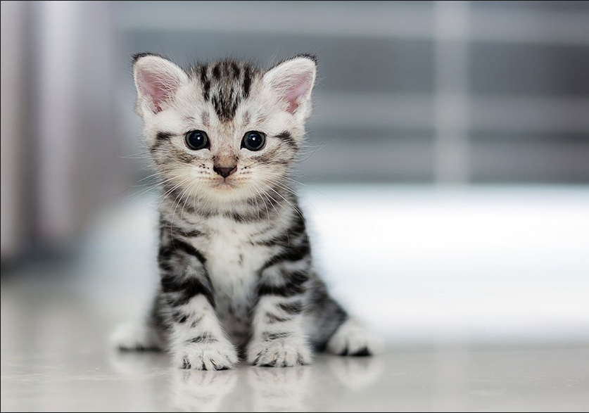
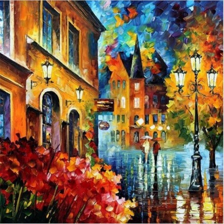
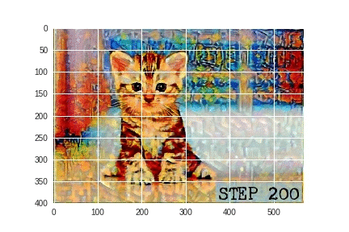

# Neural Style Transfer 
Pytorch Implementation Of Neural Style Transfer Utilizing VGG19 Architecture

## About 
Neural Style Transfer is an optimization technique which take two images as input generally called **content** and **style image**, 
then it tries to generate a new image having content *(objects)* of the **content image** and style *(colors)* of the **style image**.

In this repository I've used VGG19 for extracting content and style of the images. Content and Style are extracted from different 
convolutional layer of VGG19.

  

  

#### Style of image is extracted from following convolutional layers:
* conv1_1
* conv2_1 
* conv3_1 
* conv4_1 
* conv5_1

#### Content of image is extracted from:
* conv4_2
## Requirement :
* Python 2.7
* Pytorch 
* Cuda
## Usage:
* Clone the repository 
* Load the content and style image *(change the path)*   
`content=loadImage('images/23.png').cuda()`  
`style = loadImage('images/2.jpg', shape=content.shape[-2:]).cuda()`
* Run the code using `python styletransfer_gc.py`. Output will be in **images** folder
* If in output you're not noticing enough style try increasing the `style_weight`. You can also increasing `steps`.  

## Results   
<table align='center'>
<tr align='center'>
<td> Content Image </td>
<td> Style Image </td>
<td> Output at Different Steps </td>
</tr>
<tr>
<td>
<td>
<td></td>
</tr>
</table>
